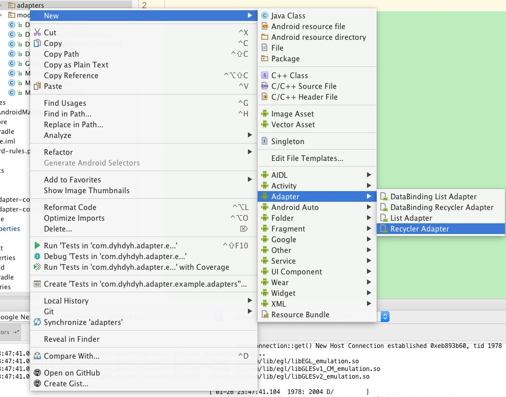
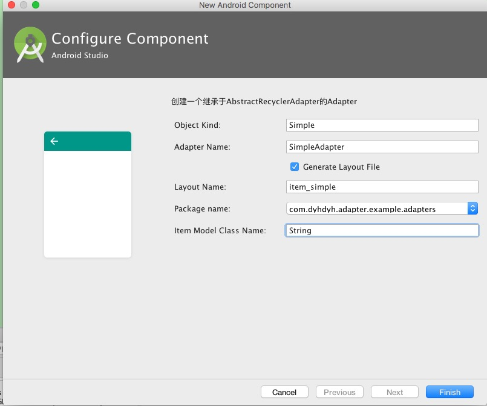
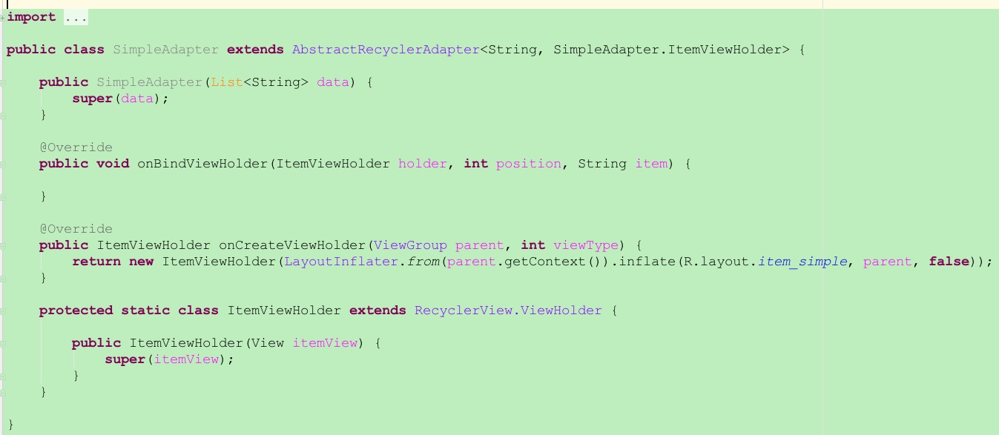

## 快速开始

### Android Studio - 在build.gradle中引入
```java
//必选
compile 'com.dyhdyh:recycler-adapters:1.1.0-beta5'
//如果需要支持DataBinding(可选)
compile 'com.dyhdyh:recycler-adapters-databinding:1.1.0-beta5'
```

### 模板安装
1.下载打包好的[templates](https://github.com/dengyuhan/android-adapters/releases/download/1.0.0/templates_1.0.0.zip)或者找到源码中的templates文件夹
2.将templates文件夹里的`adapters`整个复制到AndroidStudio模板目录下<br/>
`/Applications/Android Studio.app/Contents/plugins/android/lib/templates`

3.重启Android Studio


### 快速生成


### 生成出来的代码
体力活都自动做好了,我们要写的就只有绑定数据了



